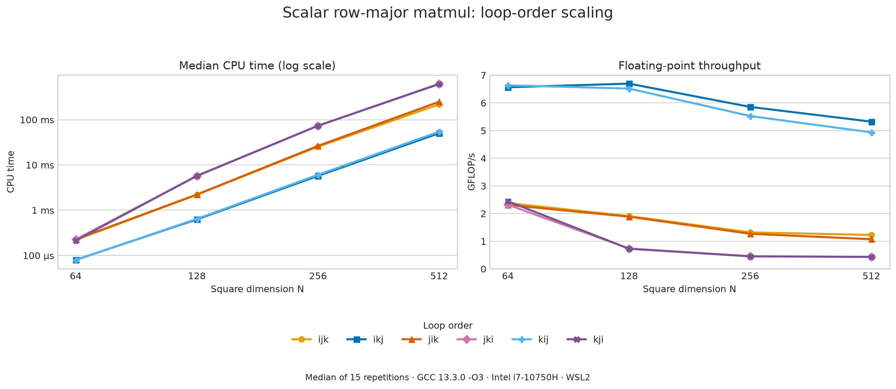
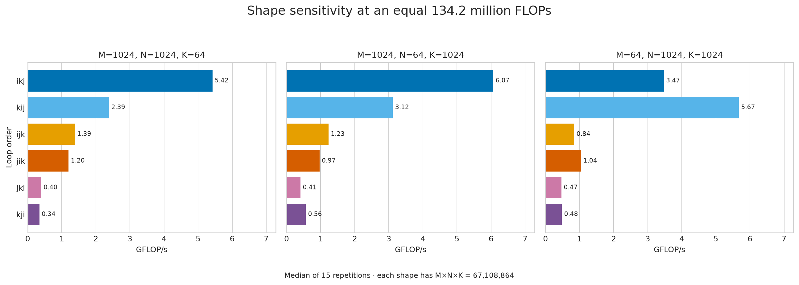

# Performance experiments

## Measurement protocol

For each future experiment, record:

- CPU model, physical/logical core count, and relevant cache sizes;
- operating system and kernel;
- compiler name, version, and optimization/ISA flags;
- build type and exact benchmark command;
- matrix shapes, input-generation method, repetitions, and reported statistic;
- whether allocation, initialization, packing, or thread creation is inside the timed region;
- raw Google Benchmark output and relevant `perf stat` counters;
- hypothesis, change made, result, and interpretation.

Use Release builds for performance measurements. Sanitizer builds are correctness tools and must
not be used for performance comparisons. Prefer native Linux for hardware-counter measurements;
when running under WSL, document counter availability and virtualization limitations.

### Environment

| Component | Value |
|---|---|
| CPU | Intel Core i7-10750H, 6 cores / 12 logical CPUs |
| L1 data cache | 32 KiB per core, 192 KiB total |
| L2 cache | 256 KiB per core, 1.5 MiB total |
| L3 cache | 12 MiB shared |
| Operating environment | Ubuntu 24.04 under WSL2, Linux 6.18.33.2-microsoft-standard-WSL2 |
| Compiler | GCC 13.3.0 |
| Language/build | C++20, Release, `-O3 -DNDEBUG` |
| Benchmark framework | Google Benchmark 1.9.5 |

WSL scheduling, background activity, CPU frequency changes, and virtualization can add noise. The
tables therefore emphasize medians and coefficients of variation (CV). Differences smaller than
the observed variation are treated as equivalent rather than as wins.

### How to read the tables

- **Median** is the middle repeated-run result and is the primary comparison statistic here.
- **CV** is standard deviation divided by mean; a larger value indicates a noisier measurement.
- **Logical bandwidth** uses the algorithm's logical bytes processed. It is not a measurement of
  physical DRAM traffic because cache-line fills, write allocation, and cache reuse change the
  actual traffic.
- A benchmark iteration is not an independent sample. Repetitions create the run-level samples
  used for mean, median, standard deviation, and CV.

## Experiment 1 -- transpose traversal and access style

### Question

For a row-major matrix transpose, is performance determined primarily by indexed versus pointer
access, or by which side of the copy is traversed contiguously?

### Variants

| Variant | Contiguous side | Inner-loop behavior |
|---|---|---|
| Indexed row-column | Source reads | Destination writes are strided |
| Source-row pointer | Source reads | Destination writes are strided |
| Indexed column-row | Destination writes | Source reads are strided |
| Destination-row pointer | Destination writes | Source reads are strided |

Each kernel uses a preallocated output matrix. Candidate correctness is checked against the public
transpose before timing. For an `N x N` matrix of doubles, logical traffic is reported as
`2 x N^2 x sizeof(double)` for one read and one write per element.

### Exploratory traversal comparison

The following 512x512 values came from one calibrated run and are retained as exploratory evidence,
not as final statistics:

| Variant | CPU time | Logical bandwidth | Relative to indexed row-column |
|---|---:|---:|---:|
| Indexed row-column | 726.7 us | 5.38 GiB/s | 1.00x |
| Source-row pointer | 738.0 us | 5.29 GiB/s | 0.98x |
| Indexed column-row | 382.6 us | 10.21 GiB/s | 1.90x |
| Destination-row pointer | 438.1 us | 8.92 GiB/s | 1.66x |

Changing to column-row traversal made output writes contiguous and produced the large improvement.
The pointer rewrite alone did not improve the source-contiguous traversal.

The reason is cache behavior. With row-column traversal, consecutive destination writes are
separated by an entire destination row. For 512 columns of doubles, that stride is 4096 bytes.
Stores repeatedly touch distant cache lines and pages. Column-row traversal instead fills each
destination cache line with adjacent stores, reducing write-allocation and dirty-line pressure.

### Controlled indexed-versus-pointer comparison

Once both implementations used destination-contiguous traversal, they were measured with 15
repetitions and random interleaving:

| Variant | Mean CPU time | Median CPU time | CV | Median logical bandwidth |
|---|---:|---:|---:|---:|
| Indexed column-row | 379.4 us | 377.4 us | 2.24% | 10.35 GiB/s |
| Destination-row pointer | 379.6 us | 376.3 us | 2.51% | 10.38 GiB/s |

The median difference is approximately 0.28%, much smaller than the 2.2-2.5% run variation. GCC's
generated assembly also contained essentially the same hot inner loop for both variants. The
result supports using the clearer indexed implementation: inlining and optimization remove the
abstraction cost, while traversal order controls the important memory behavior.

The public transpose has not yet been switched to the destination-contiguous indexed traversal;
that change should follow validation across all registered square and rectangular shapes.

## Experiment 2 -- adding a vector to each row

### Question

Does manually walking `data()` improve an already row-major, contiguous operation compared with
inlined `matrix(row, col)` and `vector[col]` access?

The kernel-only comparison mutates a preallocated matrix repeatedly. Both variants traverse matrix
rows and the increment vector contiguously. Results used seven repetitions with random
interleaving.

| Shape | Variant | Mean CPU time | Median CPU time | CV | Median items/s |
|---|---|---:|---:|---:|---:|
| 512x512 | Indexed | 69.5 us | 68.7 us | 2.58% | 3.81 G/s |
| 512x512 | Manual data pointer | 73.9 us | 73.4 us | 6.06% | 3.57 G/s |
| 1024x1024 | Indexed | 461.6 us | 441.6 us | 10.60% | 2.37 G/s |
| 1024x1024 | Manual data pointer | 428.8 us | 422.4 us | 6.35% | 2.48 G/s |

The apparent winner reverses with size: indexed is 6.7% faster by median at 512x512, while the
manual pointer variant is 4.5% faster at 1024x1024. Those differences are comparable to the
observed CV and do not establish a consistent advantage.

Both versions already have the same cache-friendly traversal. After the tiny accessors were moved
into the headers, GCC could reduce indexed expressions to efficient address increments. The current
evidence therefore favors the clearer indexed source until a repeatable improvement is measured.

## Experiment 3 -- trace access style

### Question

Is direct `data()` indexing faster than the inlined `matrix(i, i)` accessor when summing a matrix
diagonal?

Both benchmark candidates are local to the same translation unit so they have equal inlining
opportunities. They perform the same validation and accumulate in `long double`; only the element
access expression differs. A diagonal is not contiguous in row-major storage: consecutive elements
are separated by a stride of `cols + 1`.

Results used nine repetitions with random interleaving:

| Dimension | Variant | Median CPU time | CV | Median logical bandwidth |
|---:|---|---:|---:|---:|
| 64 | Direct data access | 37.5 ns | 13.43% | 12.72 GiB/s |
| 64 | Indexed `operator()` | 36.0 ns | 9.52% | 13.23 GiB/s |
| 512 | Direct data access | 443 ns | 8.40% | 8.61 GiB/s |
| 512 | Indexed `operator()` | 427 ns | 3.67% | 8.93 GiB/s |

Indexed access was approximately 4% faster in these samples, but the difference is smaller than the
observed variation. There is not enough evidence to rewrite the public function. The direct-data
implementation remains the default while more sizes and a quieter measurement environment are
tested.

## Experiment 4 -- scalar matmul loop ordering

### Question

How much does loop ordering affect a scalar row-major matrix multiplication, and does one ordering
remain best for square and rectangular matrices?

### Method

For arguments `M/N/K`, the benchmark multiplies `A(M x K)` by `B(K x N)` into `C(M x N)`. All six
permutations of the `i`, `j`, and `k` loops execute the same update:

```text
C(i, j) += A(i, k) * B(k, j)
```

Each candidate is validated before timing and uses a preallocated result. Clearing `C` is inside
every timed kernel, so allocation is excluded while equal result-initialization work is included.
Inputs are constructed before timing. The full run used a Release build, 0.5 seconds minimum time,
0.2 seconds warmup, 15 repetitions, random interleaving, and aggregate-only reporting:

```bash
./build/release/benchmarks/linalg_benchmarks \
    --benchmark_filter='^BM_MatMul.*Kernel' \
    --benchmark_min_time=0.5s \
    --benchmark_min_warmup_time=0.2 \
    --benchmark_repetitions=15 \
    --benchmark_enable_random_interleaving=true \
    --benchmark_report_aggregates_only=true
```

The measurements were taken on the environment documented above. The
[selected aggregate data](data/matmul-loop-orders-2026-08-30.json) contains the medians and CVs
extracted from the supplied console output. Future runs should save Google Benchmark JSON directly
with `--benchmark_out` rather than relying on console extraction. Rebuild both figures with:

```bash
source .venv/bin/activate
python3 -m tools.plot_visualizer.generate_matmul_figures
```

### Square scaling



| N | Fastest observed | Median CPU time | Throughput | Slowest observed | Median CPU time | Time ratio |
|---:|---|---:|---:|---|---:|---:|
| 64 | `kij` | 79.0 us | 6.64 GFLOP/s | `jik` | 226.7 us | 2.87x |
| 128 | `ikj` | 626.3 us | 6.70 GFLOP/s | `kji` | 5.758 ms | 9.19x |
| 256 | `ikj` | 5.731 ms | 5.86 GFLOP/s | `kji` | 73.663 ms | 12.85x |
| 512 | `ikj` | 50.433 ms | 5.32 GFLOP/s | `jki` | 622.664 ms | 12.35x |

The table reports observed winners, not proof that one of the two inner-`j` variants is universally
superior. At `N=64`, for example, `kij` was only about 1.1% ahead of `ikj`, while their CPU-time CVs
were 9.52% and 3.40%. The meaningful result is the separation between locality groups:

| Innermost loop | Orders | Row-major access behavior | Observed group |
|---|---|---|---|
| `j` | `ikj`, `kij` | contiguous `B(k,j)` reads and `C(i,j)` updates | fastest |
| `k` | `ijk`, `jik` | contiguous `A(i,k)`, but `B(k,j)` is strided by `N` | middle |
| `i` | `jki`, `kji` | both `A(i,k)` and `C(i,j)` advance with large strides | slowest at larger sizes |

At `N=64`, the three matrices occupy about 96 KiB together and fit within the 256 KiB L2 cache.
At `N=128`, their combined storage is about 384 KiB and no longer fits. The sharp drop of the
inner-`i` variants from roughly 2.3-2.4 GFLOP/s to about 0.73-0.74 GFLOP/s is consistent with cache
locality becoming important, but hardware counters are still needed to establish the precise cause.

### Rectangular shape sensitivity

The next three shapes are permutations of the same dimensions. Consequently, each performs exactly
`2 x M x N x K = 134,217,728` reported FLOPs; only the matrix shapes and traversal behavior change.



| M/N/K | `ikj` | `kij` | Faster observed variant | Throughput ratio |
|---|---:|---:|---|---:|
| 1024/1024/64 | 5.42 GFLOP/s | 2.39 GFLOP/s | `ikj` | 2.27x |
| 1024/64/1024 | 6.07 GFLOP/s | 3.12 GFLOP/s | `ikj` | 1.95x |
| 64/1024/1024 | 3.47 GFLOP/s | 5.67 GFLOP/s | `kij` | 1.63x |

Both variants have contiguous inner `j` loops, yet exchanging the outer `i` and `k` loops reverses
the winner when `M` becomes small. One plausible explanation is reuse: `ikj` keeps one output row
active while sweeping `k`, whereas `kij` keeps one row of `B` active while visiting every output
row. With `M=64`, reusing a `B` row across the small number of output rows appears more favorable;
with `M=1024`, repeatedly walking the much larger set of output rows appears more costly. This is an
inference from timing, not a cache-miss measurement, and should be tested with `perf` counters.

### Repeatability and next measurements

A separate focused `256x256x256` run reproduced the same three performance groups and the same
`ikj`/`kij` ordering. Individual medians differed by up to about 5%, and the nearly tied `jki` and
`kji` variants exchanged order. This supports the broad locality conclusion while warning against
over-interpreting small differences between close kernels.

Next, profile representative `ikj`, `kij`, and `jki` cases at `512x512x512` and across the three
rectangular shapes. Useful evidence includes cycles, instructions, IPC, L1/L2/LLC misses, and
possibly TLB events. Cache blocking should be introduced only after those baseline profiles are
recorded.

## Current conclusions

1. Memory traversal can matter far more than syntax. Destination-contiguous transpose traversal
   produced a large, consistent improvement over source-contiguous traversal.
2. Raw pointers are not automatically faster. When accessors are visible to the optimizer, indexed
   and pointer expressions can compile into equivalent loops.
3. A result smaller than the benchmark's variability is not a performance win. Reversing winners
   across sizes is evidence to investigate further, not a reason to select one implementation.
4. Kernel-only and end-to-end benchmarks answer different questions. Allocation and copying must be
   included when evaluating the public operation but excluded when isolating a traversal kernel.
5. In scalar row-major matmul, keeping `j` innermost creates the strongest loop-order group because
   both `B` reads and `C` updates are contiguous. At `512x512x512`, loop order alone changed median
   CPU time by more than 12x.
6. A good inner loop is necessary but not sufficient. Rectangular matrices reversed the observed
   winner between `ikj` and `kij`, showing that outer-loop reuse and problem shape must guide later
   blocking decisions.

## Reproducing focused measurements

Build once in Release mode:

```bash
cmake --preset release
cmake --build --preset release
```

List names before constructing a regular-expression filter:

```bash
./build/release/benchmarks/linalg_benchmarks --benchmark_list_tests
```

Run one quick transpose comparison:

```bash
./build/release/benchmarks/linalg_benchmarks \
    --benchmark_filter='^BM_Transpose.*Kernel/512/512$' \
    --benchmark_min_time=0.1s \
    --benchmark_repetitions=7 \
    --benchmark_enable_random_interleaving=true \
    --benchmark_report_aggregates_only=true
```

Run the focused trace experiment and save machine-readable results:

```bash
./build/release/benchmarks/linalg_benchmarks \
    --benchmark_filter='^BM_Trace.*' \
    --benchmark_min_time=0.2s \
    --benchmark_repetitions=15 \
    --benchmark_enable_random_interleaving=true \
    --benchmark_report_aggregates_only=true \
    --benchmark_out=/tmp/trace-results.json \
    --benchmark_out_format=json
```

The JSON output is intended for later tables and charts. `/tmp` is temporary; copy important raw
results into a persistent local results directory before restarting WSL.

### Creating plots for the documentation

The optional [benchmark plot visualizer](../tools/plot_visualizer/README.md) generates SVG or PNG
figures from saved Google Benchmark JSON. For example:

```bash
source .venv/bin/activate
python3 -m tools.plot_visualizer benchmark-results/matmul.json \
    --shape=512/512/512 \
    --metric='FLOP/s' \
    --output=docs/images/matmul-512.svg
```

Raw files in `benchmark-results/` stay ignored because they are machine-local evidence. Selected
plots under `docs/images/` may be committed when the surrounding text records the environment,
command, statistic, limitations, and interpretation. The tool-local guide contains the complete
installation, CLI, Python API, and Markdown instructions.

## Experiment template

### Question

What behavior are we trying to explain?

### Baseline

Which implementation and environment establish the comparison point?

### Hypothesis

What specific architectural or algorithmic effect should change?

### Method

Which single relevant variable changes, and which variables remain controlled?

### Results

Link the raw data and report time, GFLOP/s, speedup, and profiler counters where meaningful.

### Interpretation

Explain whether the result supports the hypothesis and what experiment should follow.

